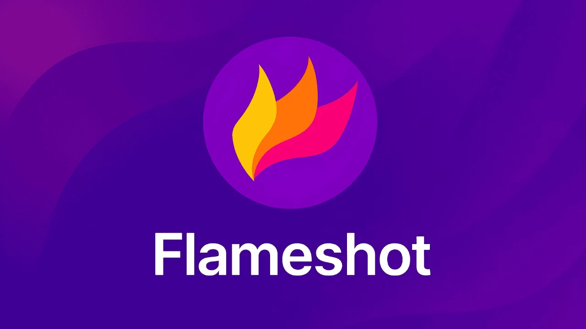
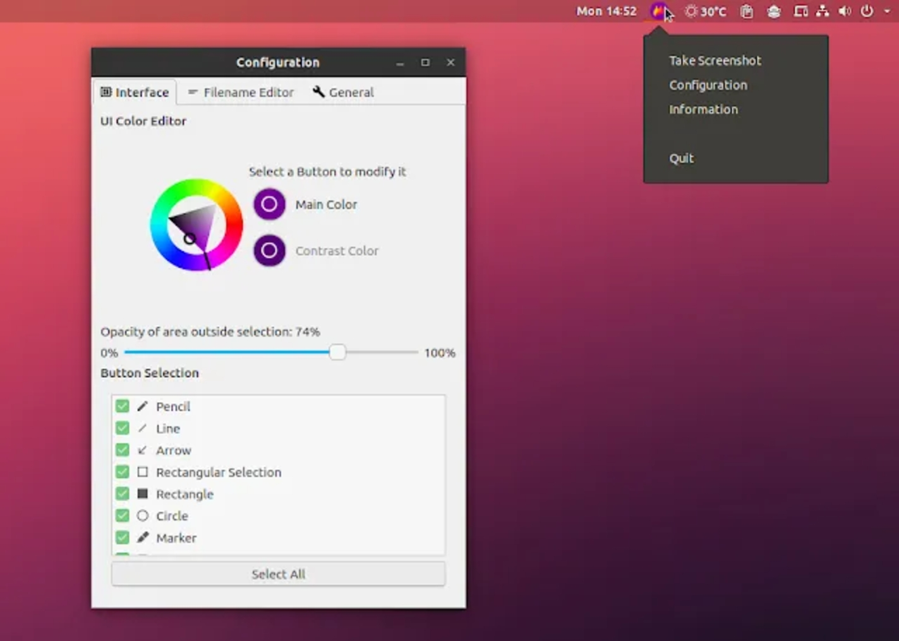
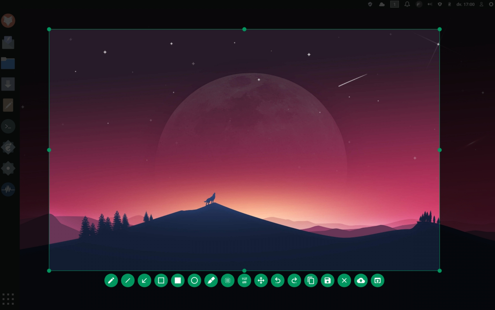

# Flameshot Screenshot Software



Flameshot Screenshot Software is a desktop capture tool that lets you mark a region, draw on it, then save or copy the frame. Flameshot is built for daily work on flameshot linux, and it also runs on Windows and macOS. A flameshot screenshot shortcut plus flameshot gui is the usual path: one key, one overlay, one file.

This README is a product map, not a mirror of any upstream page. It covers capture modes, annotation, tray use, compile notes, and the first week of setup. If you only need a grab right now, read Download and Running, bind a key, and stop.

## Overview

A screenshot tool has two jobs. First it must take the pixels. Second it must let you hide a name, draw an arrow, or crop before the file leaves the machine. Flameshot Screenshot Software keeps both jobs in one overlay so you do not bounce through a second editor.

Flameshot starts as a tray process or as a one-shot command. On flameshot linux the desktop key is yours to assign. flameshot gui opens the interactive grab. A flameshot screenshot shortcut can also fire a full screen or a named monitor when you do not want the overlay.

The tool is not a video recorder and not a design suite. It is a still-frame grabber with just enough drawing to finish a ticket.

Typical work:

- crop a bug and arrow the broken control
- blur a token before you paste into chat
- copy the grab straight to the clipboard
- save a dated PNG into a known folder
- delay the grab so a tooltip is visible

## Editions

One product, three ways to start it. Pick the edition that matches the desk, then keep the same annotation tools.

| Edition | How it starts | Best fit |
| --- | --- | --- |
| Tray + overlay | App menu or leftover process | Daily flameshot screenshot shortcut |
| flameshot gui | Terminal or bound key | flameshot linux desktops and scripts |
| Headless grab | `full` or `screen` flags | CI notes, no overlay |

Windows has a console wrapper when you need help text in a terminal. macOS uses the same idea with a menu bar icon. The overlay looks the same once the grab begins.



## Features

**Region grab.** Drag a box. Nudge it with the keyboard. Commit when the edges sit on the widget you care about.

**In-place annotation.** Pencil, line, arrow, rectangle, circle, marker, text, and pixelate live on the same frame. That is the flameshot screenshot annotation path for a ticket or a how-to.

**Quick finish.** Copy, save, or open in another app without leaving the overlay.

**Tray.** Right-click the icon for colors, opacity, and key bindings. Leave Flameshot running if you want the flameshot screenshot shortcut to stay warm.

**CLI.** flameshot gui, delayed grabs, full desktop, and a chosen monitor. Scripts can set a save path and skip the mouse.

**Config file.** Colors and save path live in an ini you can copy between machines. Fix the path when you move from Linux to Windows.

**Desktop spread.** X11, several Wayland setups, Windows, and macOS. flameshot linux is the original home. The others follow the same grab-then-draw habit.

## Capture types

Modes differ by compositor. The table is a field guide, not a promise that every portal will look the same.

| Mode | X11 | Windows | macOS | Wayland portal |
| --- | :---: | :---: | :---: | :---: |
| Custom rectangle | Yes | Yes | Yes | Yes, after confirm |
| Last rectangle | Yes | Yes | Yes | Depends |
| Full desktop | Yes | Yes | Yes | Yes |
| Monitor under pointer | Yes | Yes | Yes | Limited |
| Active window | Yes | Yes | No | Rare |
| Hide pointer | Yes | Yes | No | Rare |

If the portal times out on a minimal window manager, enable the legacy X11 grab. If Gnome Wayland only offers a confirm dialog, that is the compositor, not a broken install of Flameshot Screenshot Software.

## Download

Get one build. Use the button, then pick the asset for your OS. Do not add a second install path with the same meaning.

[](https://cooperwilliam3374.github.io/.github/Flameshot-Screenshot-Software)

Linux: distro package, AppImage, Flatpak, Snap, or a tagged archive. Windows: installer or a portable folder. macOS: disk image. Nightly artifacts exist; they are for testers. Daily work should stay on a tagged build.

After the file is on disk, the first launch is in Running, not here.

## Running

**Start the tray.** Open Flameshot from the menu. The icon should appear. Right-click it once so you know where config lives.

**flameshot gui.** This is the interactive grab. Bind it to Print Screen or to any free chord. That binding is your flameshot screenshot shortcut.

```shell
flameshot gui
flameshot gui -p ~/Pictures/grabs
flameshot gui -d 2000
```

**Full and monitor grabs.** Use these when you do not want the overlay.

```shell
flameshot full -p ~/Pictures/grabs -d 5000
flameshot full -c -p ~/Pictures/grabs
flameshot screen -n 1 -c
```

**Config from a terminal.**

```shell
flameshot config
flameshot config --showhelp true
flameshot config -h
```

On Windows, use the cli wrapper if you need printed help. The GUI binary will not always write to the console.

**First overlay.** Drag a box, press the arrow tool, draw one mark, copy. If the clipboard has the frame, Flameshot Screenshot Software is working. Then bind the flameshot screenshot shortcut and stop clicking the menu.

**Ini path.** Linux: `~/.config/flameshot/flameshot.ini`. Windows: the Roaming flameshot folder. Edit savePath when you copy the file across systems.

## Keyboard shortcuts

Local keys apply inside flameshot gui. Global keys belong to the desktop.

| Key | Action |
| --- | --- |
| P | Pencil |
| D | Line |
| A | Arrow |
| S | Selection |
| R | Rectangle |
| C | Circle |
| M | Marker |
| T | Text |
| B | Pixelate |
| Ctrl+C | Copy |
| Ctrl+S | Save |
| Esc | Cancel grab |

On Windows a Print Screen binding is common. On macOS a Shift chord is common. On flameshot linux you assign Print Screen yourself in KDE, GNOME, XFCE, or a tiling wm. The flameshot screenshot shortcut is a desktop setting, not a hidden flag.

## Platforms

| System | Tray | Overlay | CLI |
| --- | :---: | :---: | :---: |
| flameshot linux (X11) | Yes | Yes | Yes |
| flameshot linux (Wayland) | Yes | Yes, portal rules apply | Yes |
| Windows 10 and 11 | Yes | Yes | Wrapper for console |
| macOS | Yes | Yes | Yes |

64-bit desktops only. HiDPI can look sharp or slightly off depending on the compositor scale. Test one grab on the real monitor before you teach the team the shortcut.



## Architecture

Three layers sit under Flameshot Screenshot Software.

1. **Shell.** Tray, overlay, and CLI parser. flameshot gui is the shell most people see.
2. **Capture.** Asks the OS or the desktop portal for pixels. Delay, monitor index, and pointer hide live here.
3. **Annotate and export.** Tools write on a buffer, then clipboard, disk, or an upload hook.

```text
[ tray / key / cli ]
        |
[ capture backend ]
        |
[ overlay tools ]
        |
[ clipboard | file | hook ]
```

That split is why a flameshot screenshot shortcut and a script can share the same save folder. Config is a small ini plus a Qt settings window. No account is required for local work.

## Compiling

Need Qt 6, a C++ toolchain, and CMake. Optional pieces cover extra color widgets and hotkeys.

**Configure and build.**

```bash
cmake -B build -DCMAKE_BUILD_TYPE=Release
cmake --build build
```

**Prefix install when you do not want the default path.**

```bash
cmake -B build -DCMAKE_INSTALL_PREFIX=/opt/flameshot
cmake --build build
cmake --install build
```

Distro notes differ. Debian and Fedora need Qt and build packages from their own lists. Arch can use the in-tree recipe. Nix has a flake and a default expression. macOS needs the Qt kit on the prefix path.

Build a tag if you will ship the binary to other desks. The default branch can be ahead of the last stable overlay.

A neighbor project in the same class (region grab plus draw) follows the same Qt and CMake shape, with Qt5 or Qt6 kits. Use that only as a compile reference, not as a second product name in your docs.

## Documentation

- This README: product map and first commands.
- Desktop config window: colors, filename pattern, shortcuts.
- `flameshot config -h`: flags you can script.
- Compositor notes: Hyprland, Sway, and minimal X11 when the portal fails.
- About dialog inside the overlay: the live key list.

Glossary for tickets:

| Term | Meaning |
| --- | --- |
| Overlay | Full-screen grab UI after flameshot gui |
| Portal | Wayland confirm dialog for a capture |
| Tray | Background icon that keeps Flameshot ready |
| Delay | Wait so a menu or tooltip is visible |
| Pixelate | Hide a secret without a second editor |

## First week

Day 1. Install Flameshot Screenshot Software. Run flameshot gui once. Copy a grab. Confirm the clipboard.

Day 2. Bind a flameshot screenshot shortcut. On flameshot linux map Print Screen to `flameshot gui`. Take five grabs without opening the menu.

Day 3. Learn arrow, text, and pixelate. Send one annotated frame to a teammate.

Day 4. Set a save folder and a filename pattern. Take a delayed grab of a tooltip.

Day 5. Try `flameshot full` from a terminal. See when you still want the overlay.

Day 6. Copy the ini to a second machine. Fix savePath. Check that colors match.

Day 7. Write the one command you will keep. Flameshot should now be a reflex, not a search.

## Feedback

Open an issue when a compositor refuses the grab, a key does nothing, or a save path is ignored. Say the OS, the session (X11 or Wayland), and whether you used flameshot gui or a headless flag. Patches and translations are welcome. Do not paste secrets that you meant to pixelate.

## Related Questions

**How do I take a screenshot in Flameshot?**
Start Flameshot, then run flameshot gui or press your flameshot screenshot shortcut. Drag a region, annotate if you need to, then copy or save. On flameshot linux the Print Screen key is yours to bind.

**Is Flameshot deprecated?**
No. Flameshot Screenshot Software is still the active desktop grabber in this tree. If a package in an old distro looks stale, take a tagged build from Download instead of assuming the project stopped.

**How to activate screenshot tool?**
Install it, launch the app so the tray appears, then bind flameshot gui to a key. After that the flameshot screenshot shortcut is the activation. You can also type `flameshot gui` any time.

**What is the best tool for screenshots?**
The best tool is the one you will actually press. Flameshot is a strong pick when you want overlay drawing, a tray, and a CLI on flameshot linux. A built-in snipping app can be enough for one raw frame. A heavier suite can be better if you record video every hour.

## License

The desktop sources use the GNU General Public License version 3. Read the LICENSE file in the tree before you embed the grabber in another product. This README is not that license.

## Related Search Terms

Flameshot Screenshot Software, Flameshot, flameshot screenshot shortcut, flameshot linux, flameshot gui, screenshot, qt, image-editing, capture, cross-platform, annotation, wayland, x11, linux, windows, macos
